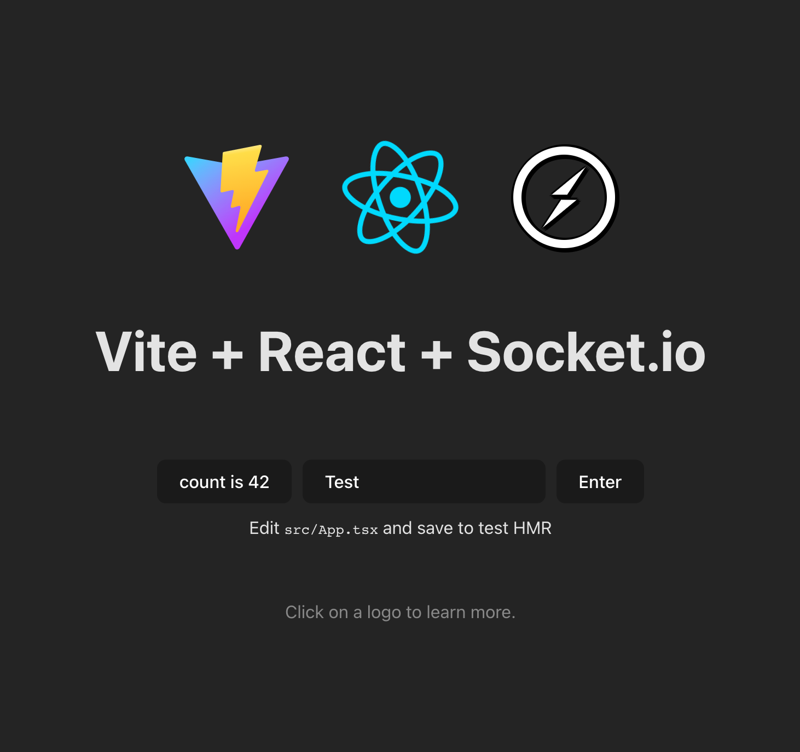
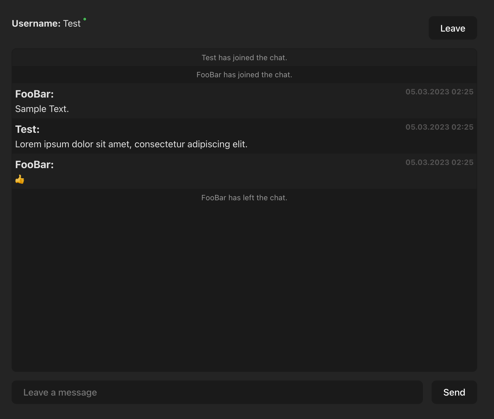

# Socket.io + React Example



Простой пример использования Socket.io в связке с React (используя функциональные компоненты).

Сервер работает на порту `3000`, клиент на `5173`.

## Пример


## Как запустить

1. Клонируем проект
2. Ставим пакеты в папке `/Client` и `/Server`
```
npm install
```
3. Запускаем сервер и клиент отдельно
```
npm run dev
```
4. Ну собстна всё 🗿


## Полезные ссылки
https://socket.io/get-started/chat

https://stackoverflow.com/questions/44628363/socket-io-access-control-allow-origin-error
